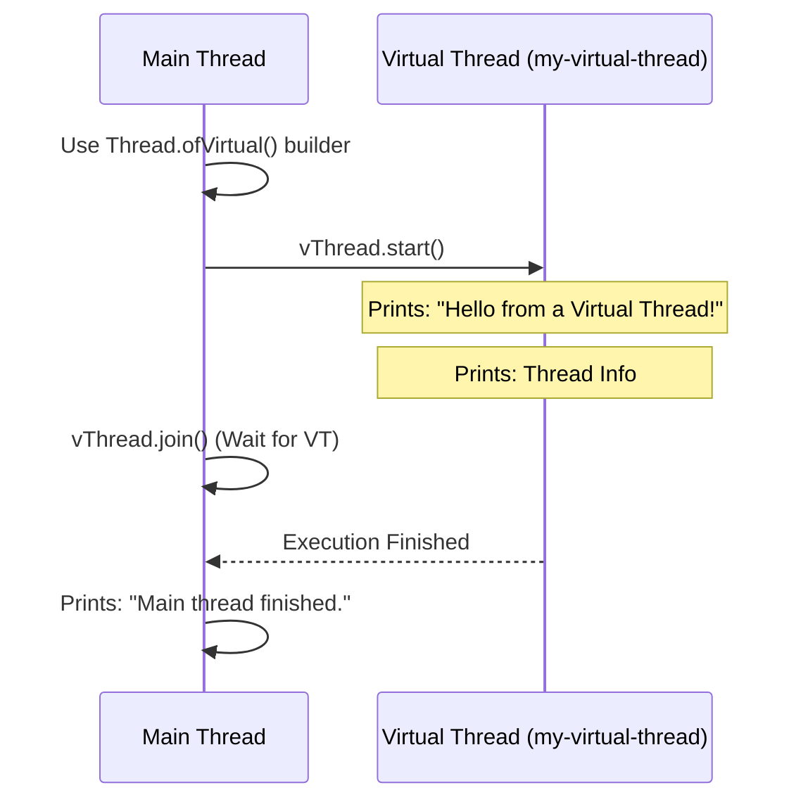
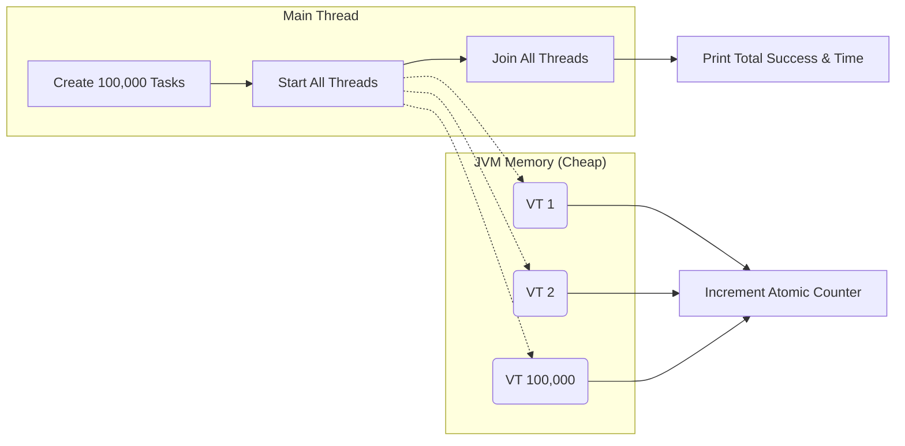
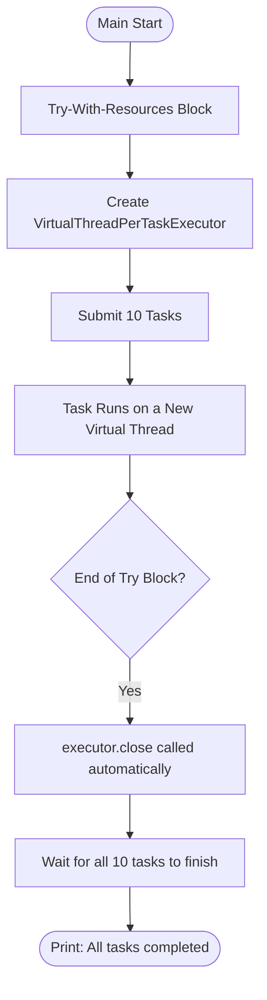
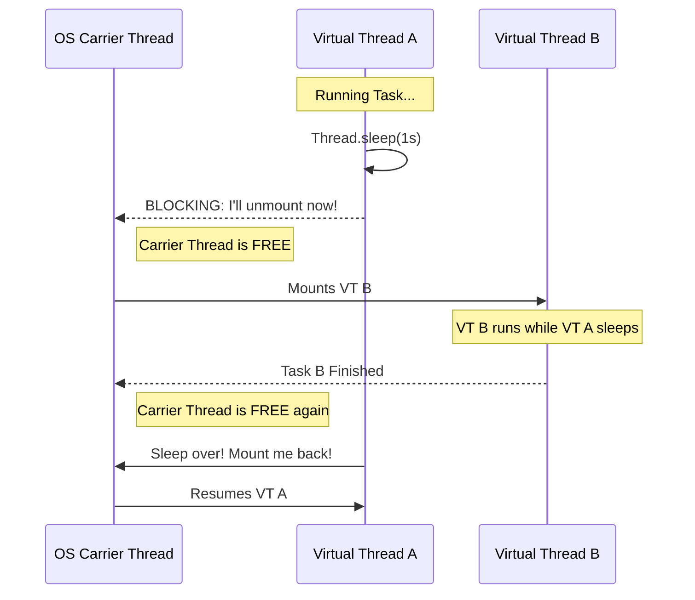

# Virtual Threads Learning Index

Use these links to jump to the diagram and explanation for each step:

1. **[Step 1: The Basics](#step-1-the-basics)** - Creating your first virtual thread.
2. **[Step 2: Scalability](#step-2-scalability)** - Running 100,000 tasks at once.
3. **[Step 3: Executor Service](#step-3-executor-service)** - The professional way to manage tasks.
4. **[Step 4: Blocking Behavior](#step-4-blocking-behavior)** - How blocking code doesn't stop the system.

📚 **Original Documentation:** [README.md](./README.md)

---

### Step 1: The Basics
**Goal:** Create, start, and wait for a single virtual thread.

**Simple Explanation:**
The program uses a "Builder" to define a virtual thread. Because virtual threads are **daemons** (they die if the main program ends), we use `join()` to tell the Main thread: "Wait here until the virtual thread is completely done."

---

### Step 2: Scalability
**Goal:** Prove that virtual threads are lightweight by spawning 100,000 of them.

**Simple Explanation:**
Instead of creating 100,000 heavy OS threads (which would crash your computer), the JVM creates 100,000 "virtual" ones that live in the JVM's memory. They all increment a shared counter safely and finish in a few seconds.

---

### Step 3: Executor Service
**Goal:** Use the "Gold Standard" production pattern.

**Simple Explanation:**
In real apps, we don't handle threads manually. We use an **Executor**. The `try-with-resources` block is a safety net: it automatically closes the executor and **waits** for every single submitted task to finish before letting the program continue.

---

### Step 4: Blocking Behavior
**Goal:** Show how `Thread.sleep` (blocking) doesn't stop other work.

**Simple Explanation:**
When a virtual thread "blocks" (like waiting for a timer or a database), it **unmounts** from the actual CPU/OS thread. The CPU doesn't sit idle; it immediately picks up another virtual thread. This is why 1,000 tasks sleeping for 1 second can all finish in just 1 second total.
